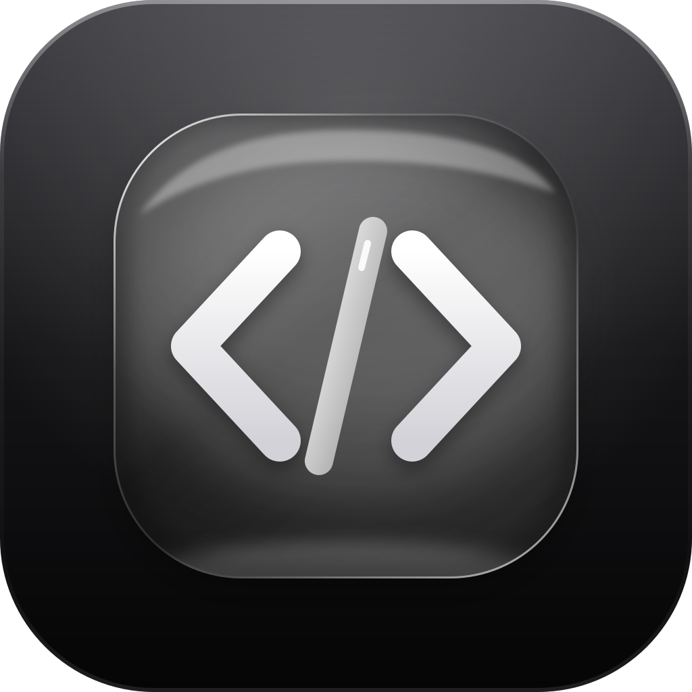
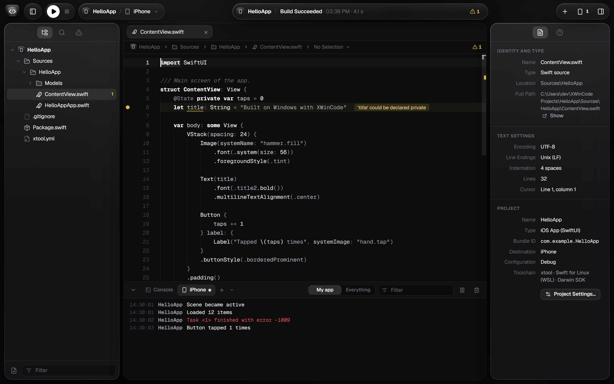
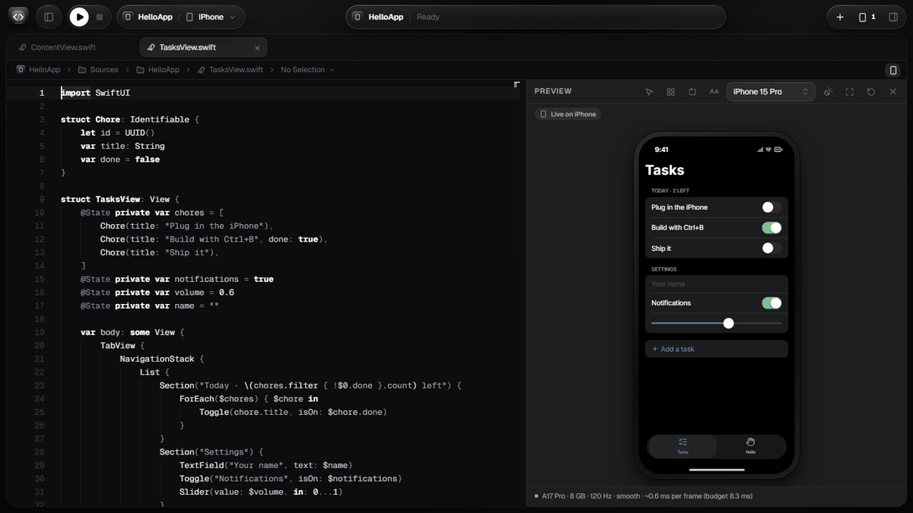
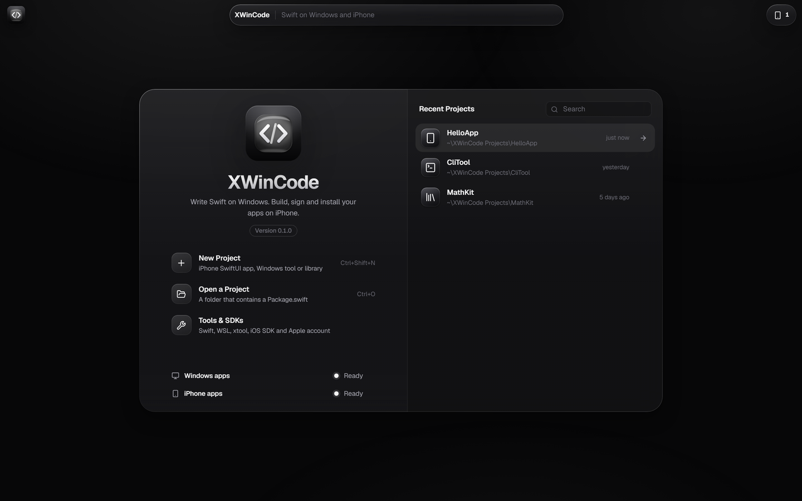
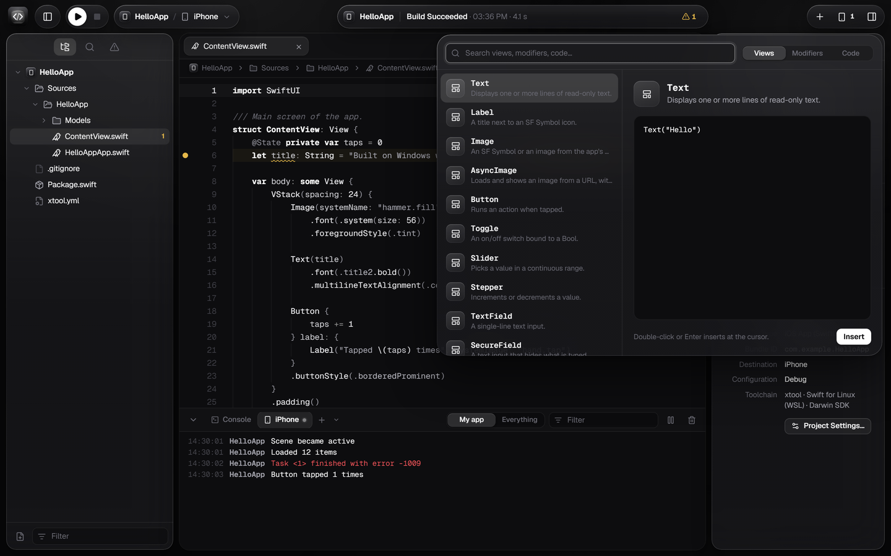

<p align="center">
  
</p>

<h1 align="center">XWinCode</h1>

<p align="center">
  <b>Xcode, for Windows.</b><br />
  Write, build and run Swift on Windows. Build, sign and install real iPhone apps. No Mac required.
</p>

<p align="center">
  <a href="https://github.com/OnelightCyber/XWinCode/releases/latest"></a>
  
  
  
  <a href="LICENSE"></a>
</p>

<p align="center">
  <a href="https://github.com/OnelightCyber/XWinCode/releases/latest"><b>Download</b></a>
  &nbsp;·&nbsp;
  <a href="#set-up-everything-in-one-line"><b>One-line setup</b></a>
  &nbsp;·&nbsp;
  <a href="#features"><b>Features</b></a>
  &nbsp;·&nbsp;
  <a href="#build-from-source"><b>Build from source</b></a>
</p>

<picture>
  <source media="(prefers-color-scheme: dark)" srcset="docs/screenshot-dark.png" />
  <source media="(prefers-color-scheme: light)" srcset="docs/screenshot-light.png" />
  
</picture>

## Get started

1. **Download** `XWinCode_x.y.z_x64-setup.exe` from the [latest release](https://github.com/OnelightCyber/XWinCode/releases/latest) and run it. It installs for your user only (no administrator rights), puts **XWinCode on your desktop** and in the Start menu, and keeps itself up to date. The installer is not code-signed yet, so SmartScreen may warn you the first time: **More info → Run anyway**.
2. **Install the toolchains.** Open **Settings → Tools & SDKs**: XWinCode checks Swift, the Visual Studio Build Tools, WSL, xtool, the iOS SDK and your Apple account, and installs whatever is missing in one click. Or let the setup script do everything at once.

### Set up everything in one line

Open PowerShell and run:

```powershell
irm https://raw.githubusercontent.com/OnelightCyber/XWinCode/main/scripts/install.ps1 | iex
```

From a clone of this repository, double-click `install.cmd` instead. The script asks for administrator rights once, can be run again at any time (finished steps are skipped), and installs:

| Step | What you get |
| --- | --- |
| Swift for Windows | The official toolchain and the Visual Studio C++ Build Tools, to build Windows programs |
| Apple Devices | Apple's USB driver, so Windows sees your iPhone |
| WSL and Ubuntu 24.04 | Placed on the drive with the most free space |
| Swift for Linux, xtool | The open-source iOS toolchain, plus libimobiledevice for the iPhone console |
| iOS SDK | Extracted from the `Xcode.xip` you download from Apple with your Apple ID |
| Apple account | Signed in through xtool's own window: your password never goes through XWinCode |
| XWinCode | The latest release, with its desktop shortcut |

Options: `-Yes` (accept every default), `-SkipWindowsToolchain`, `-SkipIos`, `-SkipApp`, `-Distro <name>`, `-Xip <path to Xcode.xip>`.

```powershell
& ([scriptblock]::Create((irm https://raw.githubusercontent.com/OnelightCyber/XWinCode/main/scripts/install.ps1))) -Xip "$HOME\Downloads\Xcode.xip"
```

## Features

**Editor**
- **Monaco** with a monochrome or Xcode theme, tabs, minimap, a jump bar that follows the symbol under the cursor, Quick Open (`Ctrl+P`) and the Command Palette (`Ctrl+Shift+P`).
- **SourceKit-LSP**: completion, hover help, go to definition, rename and live diagnostics. WSL warms up in the background at launch, so it is ready when you are.
- **Format on save** with SourceKit-LSP, and **search and replace** across the whole project (`Ctrl+Shift+F`).
- **SwiftUI Library** (`Ctrl+Shift+L`): about sixty views, modifiers and snippets, inserted with tab stops.

**Canvas**
- **Live SwiftUI preview** (`Ctrl+Alt+Enter`) next to the code, redrawn as you type. A built-in Swift interpreter runs your views, `#Preview` blocks and `PreviewProvider`s, with `@State`, bindings, `@Observable` models, navigation, tabs, lists, forms and controls that respond to clicks.
- **29 iPhones and 6 iPads**, from iPhone 11 to iPhone 17 Pro Max: real screen sizes, safe areas, Dynamic Island or notch, portrait or landscape, light and dark, every Dynamic Type size. Each model comes with a frame-time estimate against its chip and refresh rate.
- **Animations and assets**: `withAnimation`, `.animation` and `.transition` play as you click; colors, SVG images and custom fonts come from your project.
- **Live on iPhone**: the free XWinCode Preview app draws the same preview with Apple's real SwiftUI on your iPhone, over USB or Wi-Fi, sends your taps back, and reports real fps, memory, CPU and thermal state. One click installs it from the Canvas. Take a screenshot of the iPhone or record a video of the preview without leaving the Canvas.
- **Selection mode**: click a view in the preview to jump to its code, and see the view under the cursor outlined. The **view inspector** changes its font, colors, padding, frame or text and rewrites the code for you. **Variants** show light and dark, several screen sizes, text sizes, orientations or every `#Preview` side by side.

<p align="center">
  
</p>

**Build, run and debug**
- **Windows programs**: Swift packages built with the official toolchain (`swift build`, `run`, `test`). Errors land in the editor, progress is live, and the console takes standard input.
- **Debugger** for Windows programs, built on LLDB: breakpoints in the gutter (`F9`), variables, call stack, Continue (`F5`), Step Over (`F10`), Step Into (`F11`) and Step Out (`Shift+F11`).
- **iPhone apps**: built, signed and installed by [xtool](https://github.com/xtool-org/xtool) in WSL, over USB or Wi-Fi.
- **Project templates**: iOS app (SwiftUI), Windows command-line tool, library with tests.
- **Project settings**: bundle ID, display name, version and build, app icon (drop any image, it is cropped to 1024 × 1024) and privacy permissions, without touching `Info.plist` by hand.

**iPhone**
- **Native detection** over usbmuxd and lockdown, with no extra tool on Windows.
- **Windows → WSL bridge** for usbmuxd through WSL interop: no usbipd, no open network port, no firewall rule.
- **iPhone console** (`Ctrl+Shift+C`): live device logs, filtered to your app or not.
- **Installed apps**: launch, reinstall or uninstall them from the Devices window.
- **Take Screenshot**: the whole iPhone screen at full resolution, saved in Pictures › XWinCode, on iOS 17 and later too. XWinCode downloads [go-ios](https://github.com/danielpaulus/go-ios) the first time, checks it against its SHA-256 and runs it without administrator rights.
- **7-day reminder**: apps signed with a free Apple ID stop working after seven days. XWinCode tells you before they expire and reinstalls them in one click.

**Everywhere**
- **Liquid glass, in monochrome**: an Xcode 26 style toolbar, glass panels over Mica, Mica Alt or Acrylic, light and dark themes that follow Windows, and a build HUD.
- **Integrated terminal** (ConPTY): PowerShell, Command Prompt or WSL.
- **8 languages**: English, Français, Español, Deutsch, Português (Brasil), Italiano, 简体中文, 日本語. XWinCode follows the Windows language until you pick one.
- **Automatic updates**, signed, straight from GitHub Releases.
- **Secure by default**: Restricted Mode for projects you have not trusted yet, strict Content Security Policy, signed and version-bound updates, no open network port, and your Apple ID password never passes through XWinCode. See [SECURITY.md](SECURITY.md).

<table>
  <tr>
    <td width="50%"></td>
    <td width="50%"></td>
  </tr>
  <tr>
    <td align="center"><sub>Welcome window: recent projects and toolchain status at a glance</sub></td>
    <td align="center"><sub>SwiftUI Library: drop views and modifiers right at the cursor</sub></td>
  </tr>
</table>

## How it works

| Target | Toolchain |
| --- | --- |
| Windows program | Official Swift for Windows (swift.org), with MSVC and the Windows SDK |
| iPhone app | xtool in WSL, Swift for Linux, the iOS SDK extracted from `Xcode.xip`, signing with your Apple ID |
| Device | Apple Mobile Device service (Apple Devices app), relayed into WSL by `socat` and `xwincode.exe --usbmux-stdio` |

Apple only ships its iOS tools for macOS. Outside a Mac, the one open-source toolchain that works is xtool, on Linux: hence WSL. There is no iOS Simulator outside macOS, so XWinCode brings its own preview: the Canvas runs your SwiftUI code in a built-in interpreter and draws an approximation of it, and Live on iPhone sends the same view tree to the XWinCode Preview app, which draws it with the real SwiftUI on your device.

## Requirements

- Windows 10 (build 19041 or later) or Windows 11, x64
- For Windows programs: Swift for Windows and the Visual Studio Build Tools with the C++ tools and the Windows SDK
- For iPhone apps: WSL 2 with Ubuntu, Swift for Linux ([swiftly](https://www.swift.org/install/linux/)), [xtool](https://github.com/xtool-org/xtool/releases), `Xcode.xip` from [developer.apple.com](https://developer.apple.com/download/all/?q=Xcode), the **Apple Devices** app, and **Developer Mode** turned on on the iPhone

The setup script and **Settings → Tools & SDKs** take care of all of it.

## Keyboard shortcuts

| Action | Shortcut |
| --- | --- |
| Build | `Ctrl+B` |
| Run | `Ctrl+R` / `F5` |
| Stop | `Ctrl+.` / `Shift+F5` |
| Test | `Ctrl+U` |
| Clean | `Ctrl+Shift+K` |
| Archive (.ipa) | `Ctrl+Shift+A` |
| Quick Open | `Ctrl+P` |
| Command Palette | `Ctrl+Shift+P` |
| Find in Project | `Ctrl+Shift+F` |
| SwiftUI Library | `Ctrl+Shift+L` |
| Canvas | `Ctrl+Alt+Enter` |
| Toggle Breakpoint | `F9` |
| Continue / Step Over / Step Into / Step Out | `F5` / `F10` / `F11` / `Shift+F11` |
| iPhone Console | `Ctrl+Shift+C` |
| New Terminal | `Ctrl+Shift+T` |
| Devices | `Ctrl+Shift+2` |
| Settings | `Ctrl+,` |
| Navigator / Debug Area / Inspector | `Ctrl+0` / `Ctrl+Shift+Y` / `Ctrl+Alt+0` |

## Build from source

You need [Node.js](https://nodejs.org) 20 or later, [Rust](https://rustup.rs) (stable, MSVC) and the Visual Studio C++ Build Tools.

```powershell
git clone https://github.com/OnelightCyber/XWinCode
cd XWinCode
npm install
npm run tauri dev      # desktop app with hot reload
npm run dev            # interface only, in the browser, with a mocked backend
npm run tauri build    # installer in src-tauri/target/release/bundle/nsis
```

Stack: [Tauri 2](https://tauri.app) (Rust), React 19, TypeScript, Monaco Editor, xterm.js.

```
src/                  React interface
  components/         toolbar, navigator, editor, consoles, sheets
  i18n/               translations, one JSON file per language, shared with Rust
  lib/                state (zustand), IPC, LSP client, commands, SwiftUI library
  lib/preview/        Swift interpreter for the Canvas (lexer, parser, runtime, iPhone models)
  components/canvas/  Canvas panel and SwiftUI renderer
src-tauri/src/
  builder.rs          scheme actions (build, run, test, archive)
  process.rs          streamed tasks and diagnostics
  device.rs           iPhone discovery (usbmuxd and lockdown)
  bridge.rs           usbmuxd bridge from Windows to WSL (stdio interop)
  idevice.rs          iPhone console and installed apps
  preview.rs          Live on iPhone link (usbmuxd tunnel to XWinCode Preview)
  capture.rs          iPhone screenshots (go-ios, verified and run on demand)
  dap.rs              debugger bridge (lldb-dap)
  installs.rs         installed apps and their expiry dates
  projcfg.rs          project settings (xtool.yml, Info.plist, icon)
  lsp.rs              SourceKit-LSP bridge (Windows or WSL)
  pty.rs              ConPTY terminals
  toolchain.rs        toolchain checks and installers
  trust.rs            Restricted Mode (trusted projects)
  i18n.rs             backend translations
src-tauri/preview-app/  XWinCode Preview, the companion iPhone app (SwiftUI, built with xtool)
scripts/
  install.ps1         one-line setup
  release.mjs         changelog, version bump and release tag
  publish-release.mjs draft release and update manifest (CI)
```

## Releases and updates

Write what changed under `## [Unreleased]` in [CHANGELOG.md](CHANGELOG.md), commit, then run:

```powershell
npm run release -- 0.2.0
```

The script turns `Unreleased` into the `0.2.0` section, bumps the version everywhere, tags `v0.2.0` with those notes and pushes. GitHub Actions builds the installer, signs it in a separate job that never sees the project's dependencies, writes `latest.json` and opens a draft release with the changelog as its notes: publish it, and every installed copy of XWinCode offers the update.

For a fork, generate your own signing key with `npx tauri signer generate`, put the public key in `src-tauri/tauri.conf.json` (`plugins.updater.pubkey`), and add the private key and its password as the `TAURI_SIGNING_PRIVATE_KEY` and `TAURI_SIGNING_PRIVATE_KEY_PASSWORD` repository secrets.

## Translations

Every string lives in `src/i18n/locales/<language>.json`, one flat file per language, read by both the interface and the Rust backend. English is the reference: a missing key falls back to English.

To add a language:

1. Copy `en.json` to `<code>.json` and translate the values. Keep `{placeholders}` as they are, and translate both halves of `_one` / `_other` plural pairs.
2. Register the code in `LANGUAGES` and `DICTS` in `src/i18n/index.ts`, and in `locales!` in `src-tauri/src/i18n.rs`.
3. Run `cargo test --manifest-path src-tauri/Cargo.toml`: it checks that every file parses and keeps the English placeholders.

Fixes to existing translations are just as welcome.

## Contributing

Issues and pull requests are welcome. Before opening a pull request, run `npx tsc --noEmit` and `cargo test --manifest-path src-tauri/Cargo.toml`; CI runs both on every push.

Found a security issue? Please report it privately, as described in [SECURITY.md](SECURITY.md).

## License

XWinCode is free software, released under the [GNU General Public License, version 3](LICENSE) or any later version (GPL-3.0-or-later). You can use, study, change and share it, as long as every version you distribute stays under the same license and comes with its source code.

## Apple software

XWinCode does not contain or distribute any Apple software: the iOS SDK is extracted from the `Xcode.xip` that you download yourself with your own Apple ID. The Xcode and Apple SDKs license agreement only allows their use on Apple-branded computers. Make that call knowingly.

---

<sub>XWinCode is not affiliated with or endorsed by Apple. Xcode, iPhone, iOS and Swift are trademarks of Apple Inc.</sub>
